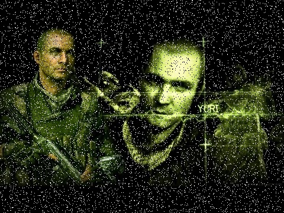

# Лабораторная работа по курсу "Проектирование распределенных защищенных приложений"
 Лабораторная работа №1: "Клиент серверная архитектура"

Лабораторная работа содержит 3 файла скрипта: 
client.py - клиент, который производит отправку изображения. 
proxy.py - промежуточный клиент-сервер, осуществялющй "перехват изображения" и его искажение при помощи шума Salt & Paper. 
server.py - основной сервер, осуществляющий прием изображения и его восстановление. 

# Изображения, полученные в результате работы программы
| Original Image |  Noise on Proxy_Server | Denoise on Server | 
|:----:|:----:|:----:|
| |  |  | 

  
# Результаты
В результате работы программы, испорченное изображение промежуточным сервером, было частично восстановлено. n
